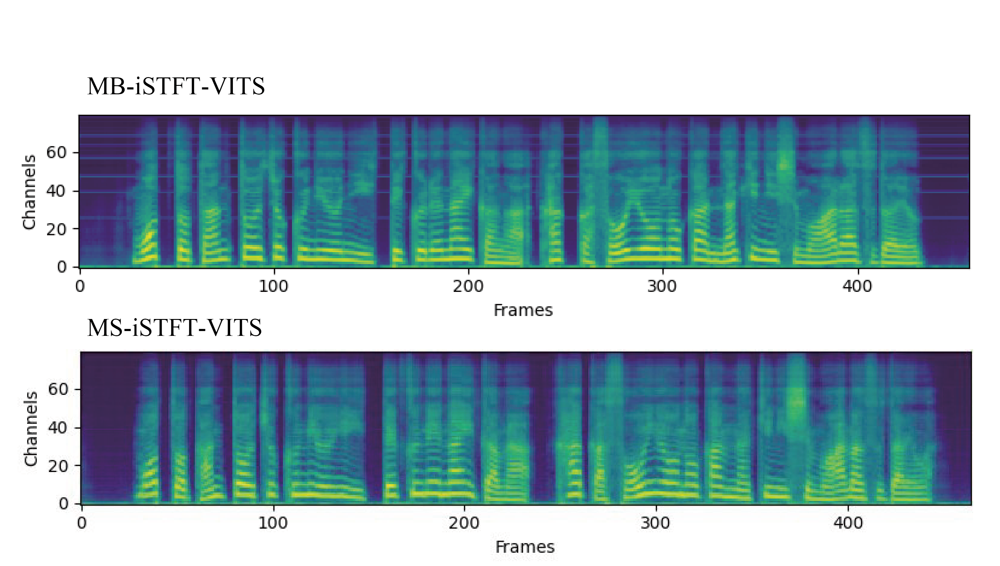

# MB-iSTFT-VITS(44100Hz 日本語対応版)
**MB-iSTFT-VITS: Lightweight and High-Fidelity End-to-End Text-to-Speech with Multi-Band Generation and Inverse Short-Time Fourier Transform**

このリポジトリは、 44100Hzの日本語音声を学習および出力できるように編集した[MB-iSTFT-VITS](https://github.com/MasayaKawamura/MB-iSTFT-VITS)です。44100Hzに対応させた際、pseudo-QMFを用いた合成では定周波ノイズが発生したため、合成フィルタを学習パラメータにすることで柔軟に対応できるようにしたMS-iSTFT-VITS実装のみを対象にしています。


## サンプル視聴 : [JSUT 1000 Epoch sample](https://drive.google.com/file/d/1eCqdsr5KkUJVtlyuq34aFL9Os9D2ERBK/view?usp=share_link) / **生成時間 : 約0.04[秒]**(A6000) ##


## 1. 環境構築

0. Anacondaで"MB-iSTFT-VITS"という名前の仮想環境を作成する。[y]or nを聞かれたら[y]を入力する。
    ```sh
    conda create -n MB-iSTFT-VITS python=3.8    
    ```
0. 仮想環境を有効化する。
    ```sh
    conda activate MB-iSTFT-VITS 
    ```
0. このレポジトリをクローンする（もしくはDownload Zipでダウンロードする）

    ```sh
    git clone https://github.com/tonnetonne814/MB-iSTFT-VITS-44100-Ja.git
    cd MB-iSTFT-VITS-44100-Ja # フォルダへ移動
    ```

0. [https://pytorch.org/](https://pytorch.org/)のURLよりPyTorch1.13.1をインストールする（_VF.stftの部分でエラーで止まったら違うバージョンに変える）
    
    ```sh
    # OS=Linux, CUDA=11.7 の例
    pip install torch==1.13.1+cu117 torchvision==0.14.1+cu117 torchaudio==0.13.1 --extra-index-url https://download.pytorch.org/whl/cu117
    ```

0. その他、必要なパッケージをインストールする。
    ```sh
    pip install -r requirements.txt 
    ```
0. Monotonoic Alignment Searchをビルドする。
    ```sh
    cd monotonic_align
    mkdir monotonic_align
    python setup.py build_ext --inplace
    cd ..
    ```

## 2. データセットの準備

[JSUT Speech dataset](https://sites.google.com/site/shinnosuketakamichi/publication/jsut)によるBasic5000音源、[ITAコーパス](https://github.com/mmorise/ita-corpus)によるEmotion音源とRecitation音源、及び自作データセット音源による、44100Hzでの学習を想定する。

-  JSUT Basic5000
    1. [JSUT Speech dataset](https://sites.google.com/site/shinnosuketakamichi/publication/jsut)をダウンロード及び展開する。
    1. 展開したフォルダの中にあるbasic5000フォルダを指定して、以下を実行する。
        ```sh
        python3 ./dataset/preprocess.py --dataset_name jsut --folder_path ./path/to/jsut_ver1.1/basic5000/ --sampling_rate 44100
        ```
-  [ITAコーパス](https://github.com/mmorise/ita-corpus) (例：[あみたろの声素材工房](https://amitaro.net/) 様)
    1. [ITAコーパス読み上げ音声](https://amitaro.net/voice/corpus-list/ita/)をダウンロードし、展開する。
    1. RECITATION音源が格納されているrecitationフォルダと、EMOTION音源が格納されているemotionフォルダを準備し、2つのフォルダが格納されているフォルダを指定して、以下を実行する。
        ```sh
        python3 ./dataset/preprocess.py --dataset_name ita --folder_path ./path/to/ita_corpus/ --sampling_rate 44100
        ```
        > ⚠音源は、ファイル名の001や002等の3桁の数字で区別するので、3桁の数字を含むこと。

        > ⚠音源を格納している2つのフォルダ名は、それぞれ”recitation”と"emotion"にすること。

-   自作データセット(単一話者)
    1. 以下の要素に注意して、読み上げ音声を準備する。([What makes a good TTS dataset](https://github.com/coqui-ai/TTS/wiki/What-makes-a-good-TTS-dataset)より)
        - テキストや発話の長さが正規分布感になってること。
        - テキストデータと発話音声に間違いがないこと。
        - 背景ノイズが無いこと。
        - 発話音声データ間で、話し方が似通っていること。
        - 使用する言語の音素を網羅していること。
        - 声色や音程の違い等をできるだけ自然に録音していること。
    1. `./dataset/homebrew/transcript_utf8.txt`に、以下の形式で音源と発話テキストを記述してください。
        ```sh
        wavファイル名(拡張子無):発話テキスト　
        ```
    1. 用意した音源が格納されているフォルダを指定して、以下を実行する。
        ```sh
        python3 dataset/preprocess.py --dataset_name homebrew --folder_path ./path/to/wav_folder/ --sampling_rate 44100
        ```
    
## 3. [configs](configs)フォルダ内のjsonを編集
主要なパラメータを説明します。必要であれば編集する。
| 分類  | パラメータ名      | 説明                                                      |
|:-----:|:-----------------:|:---------------------------------------------------------:|
| train | log_interval      | 指定ステップ毎にロスを算出し記録する                      |
| train | eval_interval     | 指定ステップ毎にモデル評価を行う                          |
| train | epochs            | 指定ステップ毎にモデル保存を行う                          |
| train | batch_size        | 一度のパラメータ更新に使用する学習データ数                |
| train | finetune_model_dir| ファインチューニング用のcheckpointsが入っているフォルダ   |
| data  | training_files    | 学習用filelistのテキストパス                              |
| data  | validation_files  | 検証用filelistのテキストパス                              |


## 4. 学習
次のコマンドを入力することで、学習を開始する。
> ⚠CUDA Out of Memoryのエラーが出た場合には、config.jsonにてbatch_sizeを小さくする。

-  JSUT Basic5000
    ```sh
    python train_latest.py -c configs/jsut_44100.json -m JSUT_BASIC5000
    ```

-  ITAコーパス
    ```sh
    python train_latest.py -c configs/ita_44100.json -m ITA_CORPUS
    ```

- 自作データセット
    ```sh
    python train_latest.py -c configs/homebrew_44100.json -m homebrew_dataset
    ```

学習経過はターミナルにも表示されるが、tensorboardを用いて確認することで、生成音声の視聴や、スペクトログラム、各ロス遷移を目視で確認することができます。
```sh
tensorboard --logdir logs
```

## 5. 推論
次のコマンドを入力することで、推論を開始する。config.jsonへのパスと、生成器モデルパスを指定する。
```sh
python3 inference.py --config ./path/to/config.json --model_path ./path/to/G_xxx.pth
```
Terminal上にて使用するデバイスを選択後、テキストを入力することで、音声が生成さされます。音声は自動的に再生され、infer_logsフォルダ（存在しない場合は自動作成）に保存されます。

## 6.ファインチューニング
ファインチューニングを行う場合は、生成器モデルのcheckpointをG_finetune.pth、識別器モデルのcheckpointsをD_finetune.pthに名前を変更し、config.jsonで記述しているfinetune_model_dirフォルダ内へと配置する。その後、「4. 学習」のコマンドで学習を開始することで、ファインチューニングを行うことが出来ます。ファインチューニングの際には**事前学習モデルを使用する**のがオススメです。

## 事前学習モデル
JSUTコーパスを1000Epoch(64Batch)学習したモデルです。以下よりダウンロードできます。

**ダウンロード：** [JSUT_1000Epoch_64Batch](https://drive.google.com/file/d/10I3dYkeVhzox1lxX1Tg_tAKQMtHkYCI0/view?usp=share_link)

## 付録
- FullBand化におけるMB-iSTFT-VITSの定周波ノイズについて。

    MB-iSTFT-VITSでは、ﾋﾟｰ（ファの音あたり）という定周波ノイズが発生し、スペクトログラムに横線が入ってしまったが、MS-iSTFT-VITSの方では発生しませんでした。モデル設定は共通にしてあるので、学習可能なフィルタが貢献しているかもしれません。



## 参考文献
- https://github.com/jaywalnut310/vits.git
- https://github.com/rishikksh20/iSTFTNet-pytorch.git
- https://github.com/rishikksh20/melgan.git
